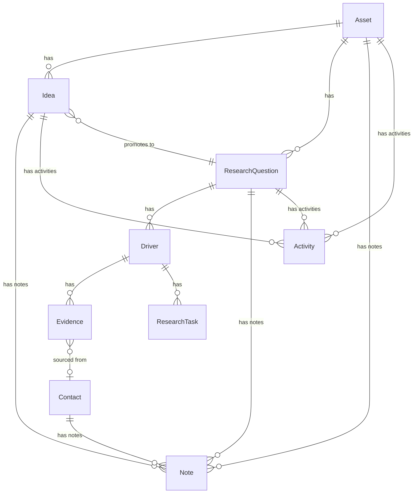

# Hyppo CRM/Projects Evolution Plan

## Summary

Transform Hyppo from a hypothesis-driven research tool into a full CRM + Projects hybrid, adding:
- **Idea entity** for pre-hypothesis exploration with stage progression
- **Note and Activity models** for chatter-style streams on every record
- **Contact model** for people and organizations linked to evidence
- **Table views** for all major entities with customizable columns
- **Global task view** surfacing all ResearchTasks across the system

---

## Architecture Overview



---

## Core Mental Model

Hyppo is best understood as a **hybrid of CRM + Projects**, applied to investment research:

| CRM Side | Project Side |
|----------|--------------|
| Exploration, ideation, qualification | Structured hypothesis testing and execution |
| Ideas mature through stages | Research Questions with formal drivers |
| Low friction capture | Methodological rigor |
| Free-form thinking | Evidence-backed validation |

Ideas progress through stages instead of being forced into a fully-formed hypothesis too early.

---

## Phase 1: New Data Models

### 1.1 Idea Model (CRM Exploration Layer)

**Purpose**: Capture unqualified ideas without friction. Allow ideas to mature before becoming formal hypotheses.

**File**: `Hyppo/Models/Idea.swift`

```swift
@Model
final class Idea {
    // MARK: - Properties
    
    /// Unique identifier for the idea
    @Attribute(.unique) var ideaId: UUID
    
    /// Brief title capturing the core spark
    var title: String
    
    /// Free-form raw thoughts, observations, intuitions
    var rawThoughts: String?
    
    /// Current stage in the CRM funnel
    var stageRaw: String  // IdeaStage enum
    
    /// Optional relevance/confidence score (1-5)
    var relevanceScore: Int?
    
    /// Early assumptions captured as simple strings (not yet Driver objects)
    var tentativeDrivers: [String]?
    
    /// Possible questions to explore (free text)
    var openQuestions: String?
    
    // MARK: - Relationships
    
    /// Parent asset this idea relates to (optional - ideas can exist without asset)
    var asset: Asset?
    
    /// Research question this idea was promoted to (if promoted)
    var promotedToQuestion: ResearchQuestion?
    
    /// Notes attached to this idea
    @Relationship(deleteRule: .cascade) var notes: [Note]?
    
    /// Activities (scheduled tasks) for this idea
    @Relationship(deleteRule: .cascade) var activities: [Activity]?
    
    /// Tags for categorization
    var tags: [Tag]?
    
    // MARK: - Metadata
    
    var createdAt: Date
    var updatedAt: Date
    var promotedAt: Date?  // When promoted to RQ
    
    // MARK: - Computed Properties
    
    var stage: IdeaStage {
        get { IdeaStage(rawValue: stageRaw) ?? .spark }
        set { stageRaw = newValue.rawValue }
    }
    
    var isPromoted: Bool {
        promotedToQuestion != nil
    }
    
    var canPromote: Bool {
        stage == .ready && !isPromoted
    }
}
```

**Stages (IdeaStage enum)**:

| Stage | Description | Typical Actions |
|-------|-------------|-----------------|
| Spark | Initial curiosity, half-formed thought | Jot down raw observation |
| Exploring | Actively reading/thinking about it | Add notes, capture links |
| Qualifying | Assessing if it's worth formal research | Define tentative assumptions |
| Ready | Clear enough to form a hypothesis | Promote to Research Question |

---

### 1.2 Note Model (Free-Form Chatter)

**Purpose**: Capture free-form observations, intuitions, and half-formed thoughts without structure. Part of the Odoo-style activity stream.

**File**: `Hyppo/Models/Note.swift`

```swift
@Model
final class Note {
    // MARK: - Properties
    
    /// Unique identifier for the note
    @Attribute(.unique) var noteId: UUID
    
    /// The note content (markdown supported)
    var content: String
    
    /// Whether this note is pinned for visibility
    var isPinned: Bool
    
    // MARK: - Polymorphic Parent (one of these will be set)
    
    /// Parent asset
    var asset: Asset?
    
    /// Parent idea
    var idea: Idea?
    
    /// Parent research question
    var researchQuestion: ResearchQuestion?
    
    /// Parent contact
    var contact: Contact?
    
    // MARK: - Metadata
    
    var createdAt: Date
    var updatedAt: Date
    
    // MARK: - Computed Properties
    
    /// Returns the parent entity type for display
    var parentType: String {
        if asset != nil { return "Asset" }
        if idea != nil { return "Idea" }
        if researchQuestion != nil { return "Research Question" }
        if contact != nil { return "Contact" }
        return "Unknown"
    }
}
```

**Key Design Decisions**:
- Notes are **not** the same as LogEntries (LogEntries are for formal timeline tracking with types)
- Notes are informal, quick capture
- Notes can be pinned for visibility
- Notes support markdown for rich formatting

---

### 1.3 Activity Model (Scheduled Tasks in Stream)

**Purpose**: Track scheduled work items that appear in the activity stream. Different from ResearchTask (which is tied to Drivers) - Activities are general-purpose follow-ups.

**File**: `Hyppo/Models/Activity.swift`

```swift
@Model
final class Activity {
    // MARK: - Properties
    
    /// Unique identifier for the activity
    @Attribute(.unique) var activityId: UUID
    
    /// Brief title of the activity
    var title: String
    
    /// Optional longer description
    var activityDescription: String?
    
    /// Optional due date
    var dueDate: Date?
    
    /// Current status
    var statusRaw: String  // ActivityStatus enum
    
    /// Priority level (1-3: low, medium, high)
    var priority: Int?
    
    // MARK: - Polymorphic Parent (one of these will be set)
    
    /// Parent asset
    var asset: Asset?
    
    /// Parent idea
    var idea: Idea?
    
    /// Parent research question
    var researchQuestion: ResearchQuestion?
    
    // MARK: - Metadata
    
    var createdAt: Date
    var completedAt: Date?
    
    // MARK: - Computed Properties
    
    var status: ActivityStatus {
        get {
            // Auto-compute overdue status
            if let due = dueDate, due < Date(), statusRaw != ActivityStatus.done.rawValue {
                return .overdue
            }
            return ActivityStatus(rawValue: statusRaw) ?? .planned
        }
        set { statusRaw = newValue.rawValue }
    }
    
    var isOverdue: Bool {
        status == .overdue
    }
    
    var isCompleted: Bool {
        status == .done
    }
}
```

**ActivityStatus enum**:

| Status | Description |
|--------|-------------|
| Planned | Scheduled but not started |
| In Progress | Currently being worked on |
| Done | Completed |
| Overdue | Past due date and not done (computed) |

**Difference from ResearchTask**:

| ResearchTask | Activity |
|--------------|----------|
| Linked to Driver | Linked to Asset/Idea/RQ |
| Research-specific actions | General follow-ups |
| "Find YoY growth data" | "Schedule call with CFO" |
| Validates assumptions | Tracks any action |

---

### 1.4 Contact Model (Knowledge Network)

**Purpose**: Track people and organizations that are sources of information. Build a "knowledge network" for each asset showing who/what influences your research.

**File**: `Hyppo/Models/Contact.swift`

```swift
@Model
final class Contact {
    // MARK: - Properties
    
    /// Unique identifier for the contact
    @Attribute(.unique) var contactId: UUID
    
    /// Display name
    var name: String
    
    /// Normalized name for search/deduplication
    var nameNormalized: String
    
    /// Type of contact (person or organization)
    var contactTypeRaw: String  // ContactType enum
    
    /// Organization/company name (for people, their employer)
    var organization: String?
    
    /// Role/title (for people)
    var role: String?
    
    /// Professional profile URL
    var linkedInUrl: String?
    
    /// Website or other URL
    var websiteUrl: String?
    
    /// Free-form notes about this contact
    var notesText: String?
    
    /// Credibility/trust score (1-5, optional, user-assigned)
    var trustScore: Int?
    
    // MARK: - Relationships
    
    /// Evidence items sourced from this contact
    @Relationship(inverse: \Evidence.contact) var evidence: [Evidence]?
    
    /// Assets this contact is relevant to
    var assets: [Asset]?
    
    /// Notes about this contact
    @Relationship(deleteRule: .cascade) var notes: [Note]?
    
    /// Tags for categorization
    var tags: [Tag]?
    
    // MARK: - Metadata
    
    var createdAt: Date
    var updatedAt: Date
    
    // MARK: - Computed Properties
    
    var contactType: ContactType {
        get { ContactType(rawValue: contactTypeRaw) ?? .person }
        set { contactTypeRaw = newValue.rawValue }
    }
    
    var evidenceCount: Int {
        evidence?.count ?? 0
    }
    
    /// Display string for the contact
    var displayTitle: String {
        if let org = organization, !org.isEmpty {
            return "\(name) (\(org))"
        }
        return name
    }
}
```

**ContactType enum**:

| Type | Examples |
|------|----------|
| Person | CEO, analyst, expert, author |
| Organization | Company, research firm, publication |

**Usage in Evidence**:
- When capturing evidence, optionally link to a Contact
- Over time, see which contacts provide the most valuable/reliable information
- Build trust profiles based on evidence quality

---

### 1.5 Enum Additions

**File**: `Hyppo/Models/Enums.swift` (additions)

```swift
// MARK: - Idea Stage

enum IdeaStage: String, Codable, CaseIterable, Identifiable {
    case spark = "Spark"
    case exploring = "Exploring"
    case qualifying = "Qualifying"
    case ready = "Ready"
    
    var id: String { rawValue }
    
    var displayName: String { rawValue }
    
    var iconName: String {
        switch self {
        case .spark: return "lightbulb"
        case .exploring: return "magnifyingglass"
        case .qualifying: return "checkmark.circle"
        case .ready: return "arrow.right.circle"
        }
    }
    
    var colorName: String {
        switch self {
        case .spark: return "yellow"
        case .exploring: return "blue"
        case .qualifying: return "orange"
        case .ready: return "green"
        }
    }
    
    var sortOrder: Int {
        switch self {
        case .spark: return 0
        case .exploring: return 1
        case .qualifying: return 2
        case .ready: return 3
        }
    }
}

// MARK: - Activity Status

enum ActivityStatus: String, Codable, CaseIterable, Identifiable {
    case planned = "Planned"
    case inProgress = "InProgress"
    case done = "Done"
    case overdue = "Overdue"
    
    var id: String { rawValue }
    
    var displayName: String {
        switch self {
        case .planned: return "Planned"
        case .inProgress: return "In Progress"
        case .done: return "Done"
        case .overdue: return "Overdue"
        }
    }
    
    var iconName: String {
        switch self {
        case .planned: return "calendar"
        case .inProgress: return "play.circle"
        case .done: return "checkmark.circle.fill"
        case .overdue: return "exclamationmark.circle.fill"
        }
    }
    
    var colorName: String {
        switch self {
        case .planned: return "blue"
        case .inProgress: return "orange"
        case .done: return "green"
        case .overdue: return "red"
        }
    }
}

// MARK: - Contact Type

enum ContactType: String, Codable, CaseIterable, Identifiable {
    case person = "Person"
    case organization = "Organization"
    
    var id: String { rawValue }
    
    var displayName: String { rawValue }
    
    var iconName: String {
        switch self {
        case .person: return "person.fill"
        case .organization: return "building.2.fill"
        }
    }
}
```

---

### 1.6 Model Relationship Updates

**Asset.swift** - Add new relationships:

```swift
// Add to existing Asset model

/// Ideas associated with this asset (CRM exploration layer)
@Relationship(deleteRule: .cascade) var ideas: [Idea]?

/// Notes attached directly to this asset
@Relationship(deleteRule: .cascade) var notes: [Note]?

/// Activities (scheduled tasks) for this asset
@Relationship(deleteRule: .cascade) var activities: [Activity]?

/// Contacts relevant to this asset (knowledge network)
var contacts: [Contact]?

// Computed properties
var ideasCount: Int {
    ideas?.count ?? 0
}

var activeIdeas: [Idea] {
    ideas?.filter { !$0.isPromoted } ?? []
}
```

**ResearchQuestion.swift** - Add new relationships:

```swift
// Add to existing ResearchQuestion model

/// Notes attached to this research question
@Relationship(deleteRule: .cascade) var notes: [Note]?

/// Activities for this research question
@Relationship(deleteRule: .cascade) var activities: [Activity]?

/// Idea this research question was promoted from (if any)
var promotedFromIdea: Idea?
```

**Evidence.swift** - Add Contact relationship:

```swift
// Add to existing Evidence model

/// Contact who provided/sourced this evidence
var contact: Contact?
```

---

## Phase 2: Table Views System

### 2.1 Design Philosophy

Following Odoo's principle: **Everything is a row in a table.**

- Users choose which columns to display
- Click a row → expand into detail view
- Table state (columns, sort, filters) persisted per entity type

### 2.2 Generic Table View Component

**File**: `Hyppo/Views/Components/EntityTableView.swift`

Core features:
- Sortable columns (click header to sort)
- Column visibility toggles (stored in UserDefaults)
- Inline row actions via context menu
- Selection handling for navigation
- Search/filter bar integration

### 2.3 Entity-Specific Table Configurations

| Entity | Default Columns | Optional Columns |
|--------|-----------------|------------------|
| **Assets** | Ticker, Name, Questions, Health | Tags, Created, Updated, Ideas |
| **Research Questions** | Question, Asset, Confidence, Status | Drivers, Evidence, Tags, Updated |
| **Drivers** | Title, RQ, Status, Evidence Balance | Tasks, Created, Sub-drivers |
| **Tasks** | Text, Driver, RQ, Completed | Asset, Created |
| **Contacts** | Name, Type, Organization | Evidence, Trust, Tags |
| **Ideas** | Title, Stage, Asset, Relevance | Notes, Activities, Tags |

### 2.4 Global Task View

**File**: `Hyppo/Views/Tasks/GlobalTasksView.swift`

**Purpose**: Single view showing all ResearchTasks across the entire system.

**Features**:
- Group by: None / Asset / Research Question / Driver
- Filter: All / Incomplete / Completed / By Date Range
- Sort: Created Date / Driver / Asset
- Click to navigate: Opens parent Driver context

**Query**:
```swift
@Query(sort: \ResearchTask.createdAt, order: .reverse) 
private var allTasks: [ResearchTask]
```

---

## Phase 3: Activity Stream Views

### 3.1 Activity Stream Component

**File**: `Hyppo/Views/Components/ActivityStreamView.swift`

**Purpose**: Unified view showing Notes + Activities (+ optionally LogEntries) in chronological order.

**Visual Design**:
- **Notes**: Chat bubble style, left-aligned, timestamp
- **Activities**: Card with status badge, due date indicator, priority
- **LogEntries** (if included): Existing card style with type indicator

**Props**:
```swift
struct ActivityStreamView: View {
    let notes: [Note]
    let activities: [Activity]
    let logEntries: [LogEntry]?  // Optional, only for RQ
    var showAddButtons: Bool = true
    
    var onAddNote: () -> Void
    var onAddActivity: () -> Void
}
```

### 3.2 Integration Points

| View | Shows |
|------|-------|
| AssetDetailView | Notes + Activities |
| IdeaDetailView | Notes + Activities |
| ResearchQuestionDetailView | Notes + Activities + LogEntries |
| ContactDetailView | Notes only |

---

## Phase 4: CRM Exploration Flow

### 4.1 Idea Management Views

**Files in** `Hyppo/Views/Ideas/`:

| File | Purpose |
|------|---------|
| `IdeaListView.swift` | Kanban board by stage OR table view |
| `IdeaFormView.swift` | Create/edit with minimal fields |
| `IdeaDetailView.swift` | Full view with activity stream |
| `IdeaPromotionSheet.swift` | Wizard to convert to RQ |

### 4.2 Kanban View Design

```
┌─────────────┬─────────────┬─────────────┬─────────────┐
│   Spark     │  Exploring  │ Qualifying  │    Ready    │
├─────────────┼─────────────┼─────────────┼─────────────┤
│ ┌─────────┐ │ ┌─────────┐ │ ┌─────────┐ │ ┌─────────┐ │
│ │ AAPL    │ │ │ NVDA AI │ │ │ MSFT    │ │ │ GOOGL   │ │
│ │ pricing │ │ │ demand  │ │ │ cloud   │ │ │ search  │ │
│ │ power?  │ │ │ drivers │ │ │ margins │ │ │ moat    │ │
│ └─────────┘ │ └─────────┘ │ └─────────┘ │ └─────────┘ │
│             │             │             │   [Promote] │
└─────────────┴─────────────┴─────────────┴─────────────┘
```

### 4.3 Promotion Flow

When promoting an Idea to a Research Question:

1. **Trigger**: "Promote to Research Question" button (only in Ready stage)
2. **Pre-fill**: 
   - Question text ← Idea title
   - Context ← Idea rawThoughts
   - Initial drivers ← Idea tentativeDrivers (converted to Driver objects)
3. **Review**: User refines the pre-filled RQ form
4. **Save**: 
   - Create ResearchQuestion with drivers
   - Link `idea.promotedToQuestion = newRQ`
   - Link `rq.promotedFromIdea = idea`
   - Set `idea.promotedAt = Date()`
5. **Navigate**: Open the new Research Question

---

## Phase 5: Contact Management

### 5.1 Contact Views

**Files in** `Hyppo/Views/Contacts/`:

| File | Purpose |
|------|---------|
| `ContactsTableView.swift` | Searchable list with filters |
| `ContactFormView.swift` | Create/edit contact |
| `ContactDetailView.swift` | Profile with linked evidence |

### 5.2 Evidence-Contact Linking

**Update EvidenceFormView**:
- Add optional Contact picker
- Auto-suggest based on URL domain (future enhancement)
- Show contact's evidence count for context

### 5.3 Contact Detail View Sections

1. **Header**: Name, type, organization, role
2. **Links**: LinkedIn, website
3. **Trust Score**: Star rating (user-assigned)
4. **Notes**: Activity stream (notes only)
5. **Evidence**: List of evidence sourced from this contact
6. **Assets**: Which assets this contact is relevant to

---

## Implementation Priority

| Priority | Feature | Effort | Value | Dependencies |
|----------|---------|--------|-------|--------------|
| 1 | Note + Activity models | Low | High | None |
| 2 | ActivityStreamView component | Medium | High | Note, Activity |
| 3 | Contact model + basic views | Medium | Medium | None |
| 4 | Global Task View | Low | High | None (uses existing) |
| 5 | EntityTableView component | Medium | High | None |
| 6 | Table views for all entities | Medium | High | EntityTableView |
| 7 | Idea model + CRM flow | High | High | Note, Activity |
| 8 | Idea-to-RQ promotion wizard | Medium | High | Idea model |

---

## Files to Create

```
Hyppo/Models/
├── Idea.swift                      # CRM exploration entity
├── Note.swift                      # Free-form chatter
├── Activity.swift                  # Scheduled tasks in stream
└── Contact.swift                   # People and organizations

Hyppo/Views/Components/
├── EntityTableView.swift           # Generic table component
├── ActivityStreamView.swift        # Notes + Activities display
└── ColumnPickerView.swift          # Column visibility picker

Hyppo/Views/Tasks/
└── GlobalTasksView.swift           # All tasks across system

Hyppo/Views/Ideas/
├── IdeaListView.swift              # Kanban or table view
├── IdeaFormView.swift              # Create/edit form
├── IdeaDetailView.swift            # Full detail with stream
└── IdeaPromotionSheet.swift        # Convert to RQ wizard

Hyppo/Views/Contacts/
├── ContactsTableView.swift         # Contacts list
├── ContactFormView.swift           # Create/edit form
└── ContactDetailView.swift         # Profile view

Hyppo/Views/Assets/
└── AssetsTableView.swift           # Table view for assets

Hyppo/Views/ResearchQuestions/
└── ResearchQuestionsTableView.swift # Table view for RQs

Hyppo/Views/Drivers/
└── DriversTableView.swift          # Table view for drivers
```

## Files to Modify

```
Hyppo/Models/
├── Asset.swift                     # Add Ideas, Notes, Activities, Contacts relationships
├── ResearchQuestion.swift          # Add Notes, Activities relationships
├── Evidence.swift                  # Add Contact relationship
└── Enums.swift                     # Add IdeaStage, ActivityStatus, ContactType

Hyppo/Views/Navigation/
├── SidebarView.swift               # Add Ideas, Contacts, Tasks sections
└── MainNavigationView.swift        # Add routing for new views

Hyppo/Views/Evidence/
└── EvidenceFormView.swift          # Add Contact picker

Hyppo/
└── HyppoApp.swift                  # Register new models with SwiftData
```

---

## Design Principles Preserved

1. **Everything is a record** - Tables first, details on demand
2. **Context before action** - Tasks always belong to something meaningful
3. **Rigor is optional but encouraged** - Nothing forced, structure available
4. **Progressive disclosure** - Simple by default, deep when needed
5. **Methodology without ceremony** - McKinsey logic preserved, bureaucracy removed
6. **AI later, not instead of thinking** - AI assists formulation, doesn't replace it

---

## What This Uniquely Enables

- **Defensible audit trail** of beliefs from spark to conclusion
- **Explicit rejection** of bad hypotheses (no thesis drift)
- **Separation** of thinking (ideas), doing (tasks), and tracking (evidence)
- **Knowledge network** showing who influences your research
- **Research that feels closer** to how elite investors and consultants actually work

---

## Questions Resolved

| Question | Decision |
|----------|----------|
| CRM Layer model | New `Idea` entity that promotes to `ResearchQuestion` |
| Activity Stream | Separate `Note` and `Activity` models (LogEntry preserved for RQ timeline) |
| Contacts scope | People + Organizations with Evidence linkage |
| Table Views | Full table-driven UI for all entities |
| Task enhancement | Global view only (existing `ResearchTask` model sufficient) |


